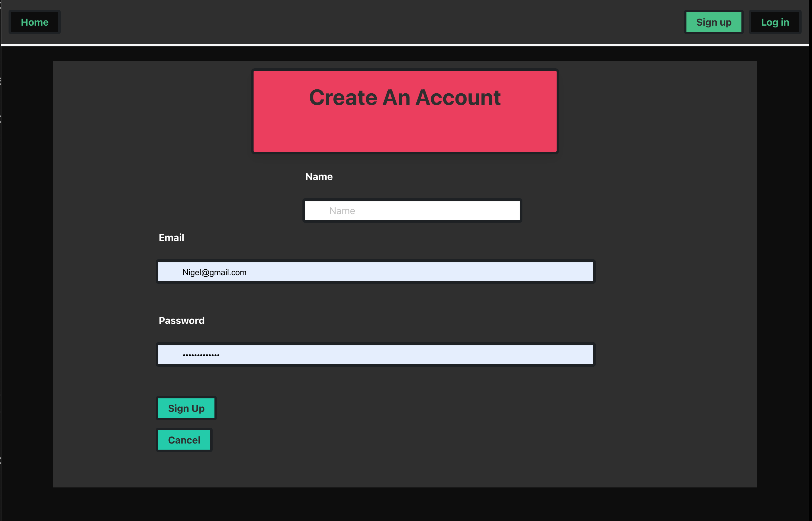
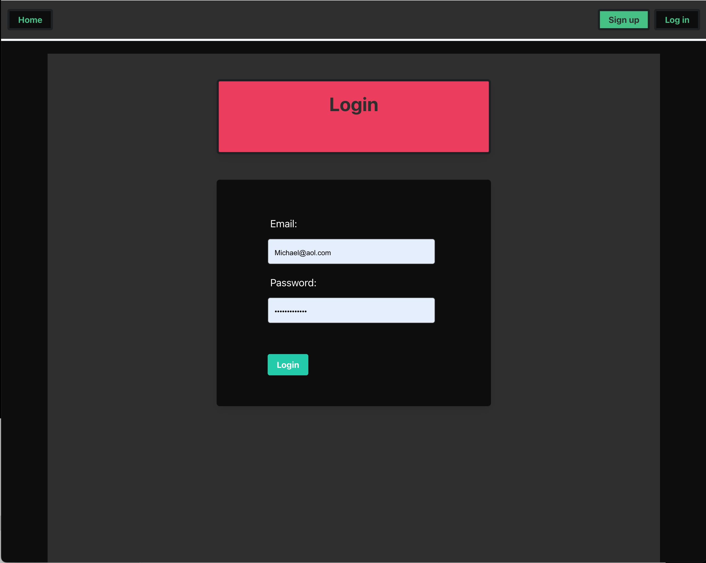
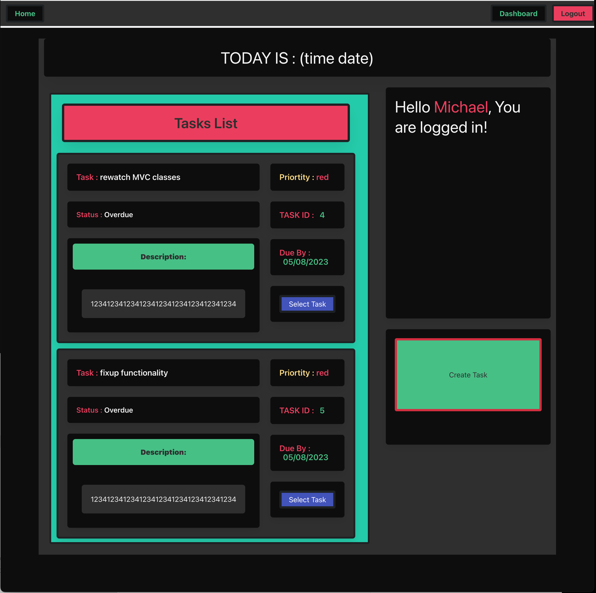
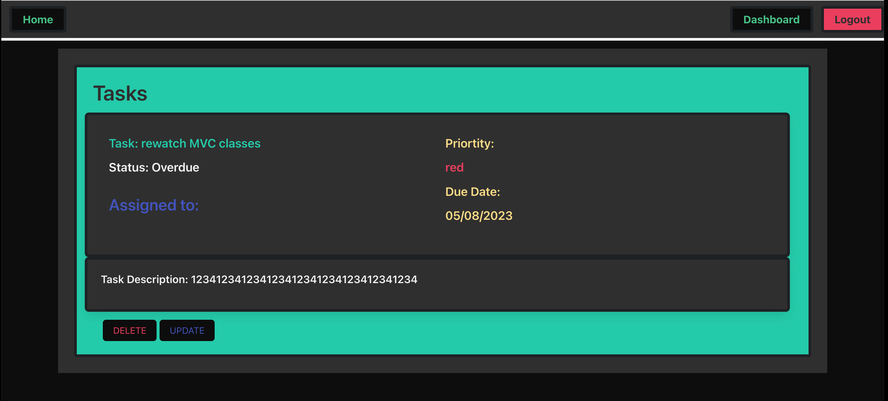
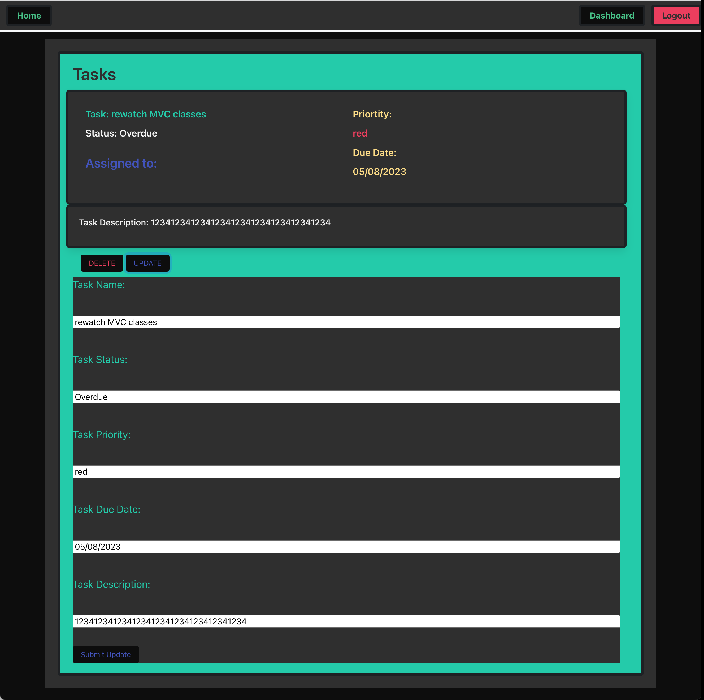

# CoordiNation

## Description
The CoordiNation Application is a full-stack web application that enables users to manage their tasks efficiently. It provides functionalities to create, update, and delete tasks, as well as set priorities, and show task statuses. The application uses Node.js and Express.js to create a RESTful API, MySQL and Sequelize ORM for the database, and Handlebars.js as the template engine. In addition, the application includes authentication, environmental variable protection, and deployment on Heroku.

## Table of Contents
- [Description](#description)
- [Installation](#installation)
- [Usage](#usage)
- [License](#license)
- [Contributing](#contributing)
- [Deployment Link](#deployment-link)

## Installation

1. Clone the repository:

```
git clone https://github.com/your_username/task-manager.git
```

2. Install the dependencies:

```
npm install
```

3. Create a `.env` file in the root directory with the following content:

```
DB_NAME='techblog_db'
DB_USER='root'
DB_PASSWORD='your-mysql-password goes here'
SESSION_SECRET='your_session_secret goes here'
```

4. Start the application:

```
npm start
```

## Usage

1. Open your web browser and go to the following URL: `http://localhost:3001/`.

2. At the Landing page register an account or log in if you already have an account.

3. You will then be taken to the Dashboard where you can view your task statuses and see your available options.

4. Create a task by clicking the "Create" button. You can set the title, description, priority, and due date.

5. Update a task by clicking the "Update" button. You can modify the title, description, priority, and due date.

6. Delete a task by clicking the "Delete" button.

7. Set the status of a task by clicking the "Set Status" button. You can choose from three statuses: "To Do", "In Progress", or "Done".

8. View tasks by status by clicking the corresponding tabs: "To Do", "In Progress", or "Done".

9. Log out by clicking the "Log Out" button.


## Screenshots











## Deployment Link

The Task Manager Application is deployed on Heroku. Please visit the following link to access the live application: [https://coordination-8.herokuapp.com/](https://coordination-8.herokuapp.com/)

## License

This project is licensed under the [MIT License](https://opensource.org/licenses/MIT).


## Contributing


## Credits

Collaborators:  

- Nigel Poblete https://github.com/evohat3
- Michael Muniz  https://github.com/m-s-muniz
- Elizabeth Niño  https://github.com/Liz-Nino64
